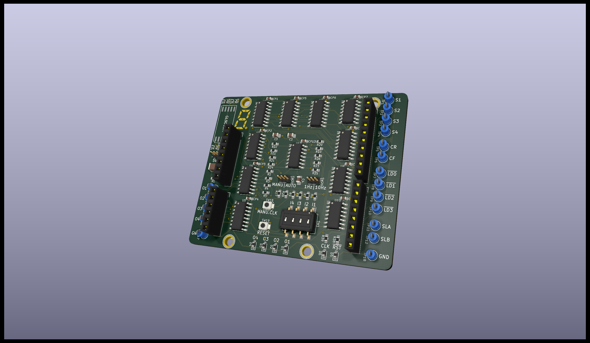

# td4-shield-rev.0

「CPUの創りかた」を読んで実験するための野良基板の試作版です。

# Photo

# Resouces

- [回路図](td4-shield-rev.0_sch.pdf)
- [部品表](td4-shield-rev.0_parts.pdf)
- [ブース](https://tokuhira.booth.pm/items/2313677)

# Features

書籍に記載の内容を少しアレンジしての製作例です。
汎用ロジックICはSOICにしています。
ROMと電源はArduinoで代用するため、UNO用Shieldとして使います。

# Requirement

Arduino互換のボードと、そのマイコンで動作するROMエミュレータプログラムが別途必要です。
色々と実験する場合はオシロスコープやロジックアナライザがあると便利だと思います。

# Installation

色々やり方はありますが、Arduino UNOに差し込むのが簡単です。
ボードのIO電圧に合わせてJP1を設定します。

# Usage

各々方でご自由に実験していただけます。

# Note

可用性、安全性、その他いかなる性質も保証しません。
いかなる用法も、またのその結果も保証しません。

# Author

* @tokuhira (twitter)
* github.com/tokuhira

# License

BSD 3-Clause License

Copyright (c) 2020, tokuhira.net
All rights reserved.
